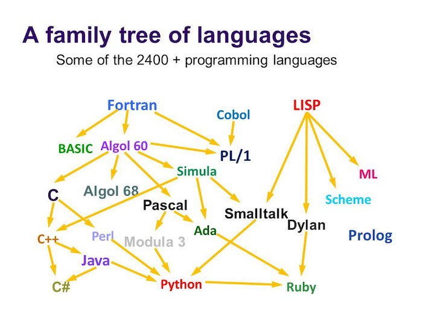

% EMAT10006 - FCP - Lecture 01
% Oscar Benjamin
% Week 13

The idea
--------

* Build on the intro unit
* Reinforce basic programming
* Think about larger codebases
* Work collaboratively
* Use version control (git/github)

Schedule
--------

* Runs from week 13 to week 23 (except week 18).
* 1hr lecture
* 2hr lab
* Dropin session
* Forum?
* Deadlines...

Assignments
-----------

| Assignment | Deadline | Group? | Weight |
|------|---------|-----------|----|
| 1 | Tuesday Wk 16 | Individual | 25% |
| 2 | Tuesday Wk 19 | Pairs      | 25% |
| 3 | Friday Wk 23 | Group of 4  | 50% |

Why Python?
-----------

* High level language
* Intends not to be hard to learn
* Suitable for scientific/engineering work
* Used heavily in data science etc
* Right tool for the job in student projects

Family tree ([source](https://medium.com/@anaharris/human-languages-vs-programming-languages-c89410f13252))
-----------



How Python?
-----------

* Created by Guido van Rossum (BDFL) in the early 90s
* Derived from the C family
* Entirely open source from the outset
* Very popular after 30 years
* See [discussions](https://discuss.python.org/)
* Named after [Monty Python](https://www.youtube.com/watch?v=vZw35VUBdzo)

Year reps?
----------

Look at forum posts?
--------------------

Terminal
--------

Quick demo...

Understand the `$` convention for input/output:
```
$ ls
myscript.py
$ python myscript.py
stuff
```

Terminal
--------

* CLI: Command Line Interface
* GUI: Graphical User Interface

Learning terminal and CLI is *not* optional here!

Command line
------------

* Lower level way of interacting with computers
* More efficient
* Reproducible
* Composable
* Automatable

Terminal
--------

Longer demo...

Build Python
------------

```console
$ wget https://www.python.org/ftp/python/3.8.1/Python-3.8.1.tgz
$ ./configure
$ make
$ make install
```

Github
------

We'll talk about this more later but here's CPython:

[https://github.com/python/cpython](https://github.com/python/cpython)

That's all
----------

Make sure to be in the lab on Friday so that you are allocated to a TA (and paired
up for future assignments).
